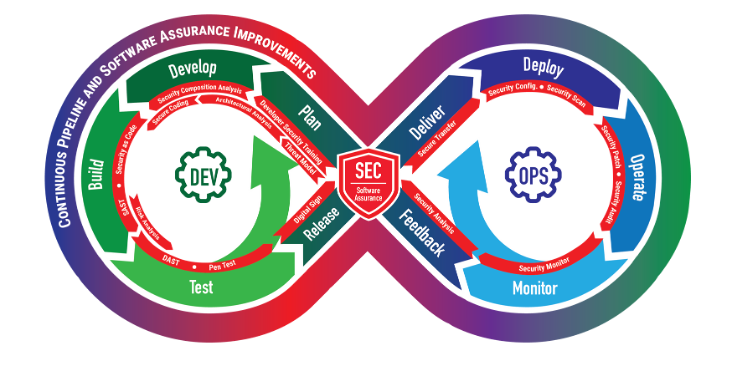
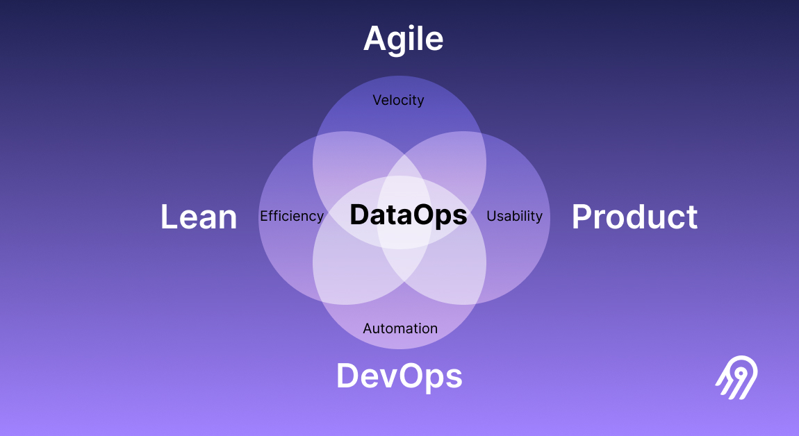
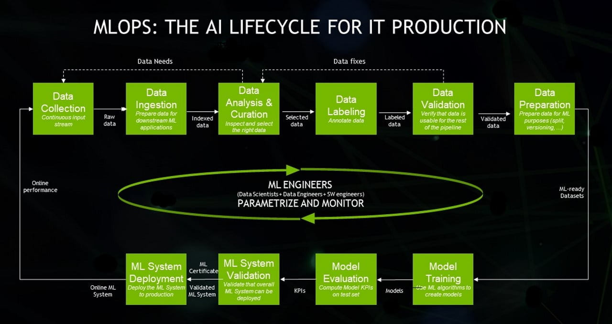
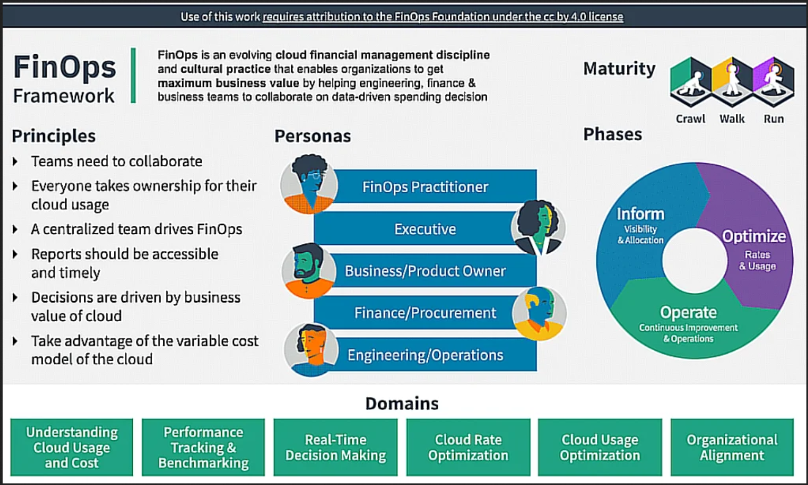
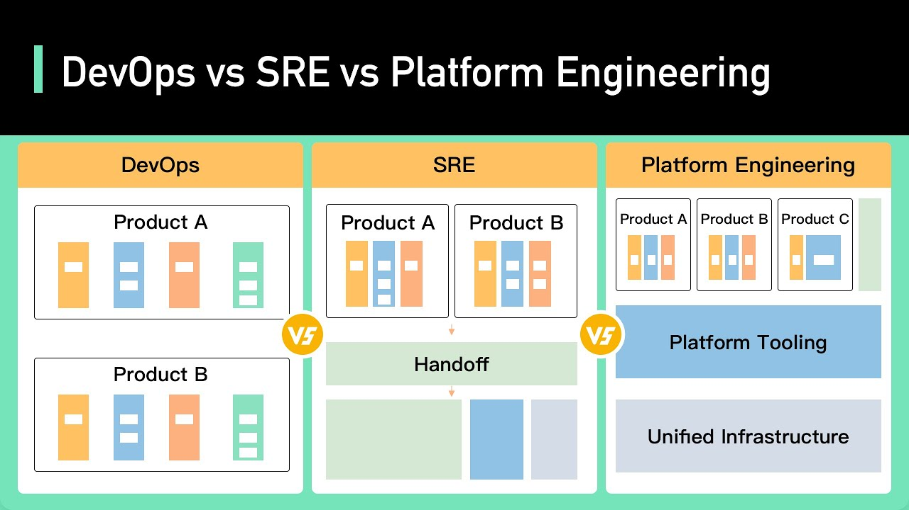
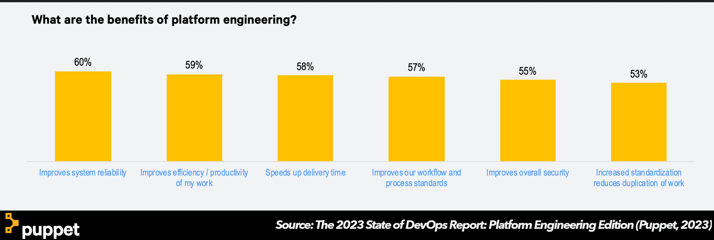

# DevOps ebook

Esse livro irá abordar DevOps de uma perspectiva geral. Não é focado em exercicíos práticos ou detalhes excessivamente tecnicos.
Linguagens suportadas: en-us, pt-br.

## Capitulos

- DevOps aplicado
  - MLOps
  - DataOps
  - GitOps
  - FinOps

- Engenharia de plataforma

## DevOps aplicado

**Contexto**  
Os principios e práticas DevOps tem sido aplicados e adotados de forma ampla. Várias áreas que inicialmente trabalhavam de outra forma, foram se moldando e até mesmo sendo criadas. Veremos como DevOps está sendo aplicados nessas áreas. 

### SecOps

O que é DevSecOps?

> SecOps, também conhecido como SecDevOps ou DevSecOps, é uma denominação da Ciência da Computação que surgiu com o objetivo de definir a integração de processos de segurança da informação às atividades de desenvolvimento e operações dentro do segmento de tecnologia. Formado por profissionais especializados em segurança e TI, o time de SecOps determina o sucesso na prevenção a ataques cibernéticos. - Wikipedia

> DevSecOps é a prática de integrar testes de segurança a todas as etapas do processo de desenvolvimento de software. Inclui ferramentas e processos que incentivam a colaboração entre desenvolvedores, especialistas em segurança e equipes de operação para criar software eficiente e seguro. O DevSecOps promove uma transformação cultural que torna a segurança uma responsabilidade compartilhada por todos que estão criando o software. - Amazon Web Services

> O termo nasceu a partir da ascensão da metodologia DevOps e consequentemente com o aumento da arquitetura de Software como serviço, onde o software desenvolvido é essencialmente hospedado em ambientes nuvem, com integração e entrega contínuas surgiu a necessidade do mercado de integrar processos de segurança dentro desse escopo de agilidade, além de tentar sobrepor as dificuldades no gerenciamento de software entre times de maneira confiável. - Wikipedia

## Caracteristicas

- Cultura
  - Promover colaboração entre os times de desenvolvimento, segurança e operações, disseminando a ideia de um mesmo principio: a entrega de software para o usuário final.
- Automação
  - Uso de automação para alcançar entregas e feedback mais rápido. É importante que a abordagem na implementação não impact na agilidade.
- Monitoramento
  - o monitoramento é muito focado em ameaças e vulnerabilidades em tempo real, com o objetivo de observar a qualidade e a segurança do objeto de estudo em todas as fases de implantação.

- Compartilhamento
  - Tradicionalmente a equipe de segurança dentro do processo de desenvolvimento de software fica mais próxima do fim do ciclo de projeto
  - SecOps promove a integração desse time dentro do escopo de concepção e desenvolvimento, tanto com objetivo de mudar a mentalidade de todo processo como de incluir maturidade no que tange aspectos relacionados à segurança da informação. 

## Práticas
- Automação de testes contínua
  - Controles de segurança automatizados em todas as partes do desenvolvimento de software são fatores importantes para garantir entregas seguras e permitir que os testes detectem anomalias em diferentes fases do processo.
- Monitoramento contínuo
  - É importante gerar evidências dos controles de segurança automatizados ao longo do processo, para que estes possam gerar o melhor resultado possível é necessário o acompanhamento de ponta-a-ponta.
- Segurança como código
  - processo de definir políticas de segurança com o uso de modelos de script (templates) ou arquivos de configuração que podem ser ativados automaticamente de acordo com agendamentos ou manualmente pelo usuário.

## Benefícios
- Proteção contínua
- Respostas rápidas e efetivas
- Diminuição nos custos de operações e violações
- Prevenção de ameaças
- Expertise de Segurança
- Conformidade
- Comunicação e colaboração
- Integração da equipe de segurança nos processos de concepção
- Automações

## Ferramentas
- Veracode
  - Veracode is an cloud-based security tool created to simplify developer security testing. It provides comprehensive visibility into your application’s security posture and offers remediation tips for any vulnerabilities it detects.
- OWASP Zed Attack Proxy (ZAP)
  - OWASP ZAP is a free and open-source web application security scanner. It is highly customizable and can identify vulnerabilities in your application and works by intercepting аnd modifying HTTР аnd HTTРS trаffic between the wеb аpplicаtion аnd сlient. ZAP has the capability to scan for a range of security issues and includes аutomаted аnd mаnuаl scаnning modes.
- SonarQube
  - SonarQube is a popular code quality tool that offers security-focused plugins to help identify code vulnerabilities during development, provides continuous feedback on your code, and enables you to maintain high code quality.
- Fortify
  - Fortify is an industry-leading application security tool that offers comprehensive testing capabilities, including static, dynamic, and interactive application security testing. It also offers integrations with leading tools for seamless DevSecOps.
- Dependabot Github
  - Dependabot é uma ferramenta que identifica vulnerabilidades nas dependências do seu código e cria Pull Requests com a atualização da dependência com a versão já corrigida.
- Snyk
  - Snyk is a popular developer-first application security tool that integrates directly into your development tools and workflows. It supports multiple languages and offers actionable insight into your app’s security posture.
- Trivy
  - Trivy is an easy-to-use open source vulnerability scanner for container images. It is stateless, is easy to deploy, and can scan images quickly without needing to download vulnerability databases. Trivy detects vulnerabilities in operating system packages (Alpine, RHEL, CentOS, etc.) and application dependencies included in container images.

Referências
- https://pt.wikipedia.org/wiki/SecOps
- https://insights.sei.cmu.edu/blog/a-framework-for-devsecops-evolution-and-achieving-continuous-integrationcontinuous-delivery-cicd-capabilities/
- https://aws.amazon.com/pt/what-is/devsecops/
- https://www.aquasec.com/cloud-native-academy/devsecops/devsecops-tools/
- https://techcommunity.microsoft.com/t5/desenvolvedores-br/descubra-vulnerabilidades-e-automatize-a-atualiza%C3%A7%C3%A3o-de/ba-p/3335240

--------------------

### GitOps 

**O que é Git?**  
Git é um sistema de controle de versão distribuído utilizado para gerenciar arquivos de diversos tipos e também uma ferramenta para colaboração de times para gerenciar o código fonte de uma aplicação.  

**O que é GitOps?**  
> O GitOps usa repositórios Git como uma única fonte de informações para oferecer **infraestrutura como código**. O código enviado verifica o **processo de CI**, enquanto o **processo de CD** verifica e aplica os requerimentos de elementos como **segurança**, **infraestrutura como código** ou quaisquer outros limites definidos para a framework de aplicações. Todas as alterações de código são acompanhadas, facilitando as atualizações e oferecendo controle de versão, caso uma reversão seja necessária. - RedHat

## Benefícios

- Um fluxo de trabalho padrão para o desenvolvimento de aplicações.
- Aumento da segurança para definir antecipadamente requisitos da aplicação.
- Maior confiabilidade com visibilidade e controle de versão pelo Git.
- Consistência entre quaisquer ambientes on-premise, clusters e nuvem.

## Caso de uso

> Imagine o seguinte cenário: você tem várias alterações a serem aplicadas em diferentes aplicações sendo executadas em diferentes clusters Kubernetes, distribuídos em mais de um cloud provider e/ou no ambiente on-premisse. Para fazer isso, você pode executar de forma manual ou desenvolver um ou mais pipelines. De qualquer forma, neste cenário existe uma grande complexidade e o esforço técnico de um time de operação, além do risco envolvido quando for necessário fazer rollback. Outra preocupação é evitar as divergências entre o que está aplicado no cluster Kubernetes e o que está versionado no git.

> Para ajudar na execução de atividades semelhantes a essa, a abordagem GitOps trata a infraestrutura como código tendo as informações versionadas em um ou mais repositórios git, tratando-os como fonte da verdade e faz uso de ferramentas para aplicar continuamente as mudanças a partir de um ponto central.

## CICD

> Em contraste com uma esteira de Implantação Contínua (CD) tradicional, onde temos um estágio executando intervenção direta no nosso ambiente, com GitOps temos um mecanismo automatizado de detecção de desvios (“drift”) que identifica se o estado desejado armazenado no repositório Git foi alterado e implementa as modificações necessárias de forma autônoma. A abordagem proposta pelo GitOps busca eliminar intervenções diretas na infraestrutura e simplificar o processo de Implantação Contínua em ambientes distribuídos, além de melhorar a governança através das informações de rastreabilidade fornecidas pelo Git. - Amazon Web Services

Reconciliação ou Sincronização é o ato de modificar o estado do cluster para equiparar com a versão armazenada no Git.

## Ferramentas

### ArgoCD
- Argo CD, é uma ferramenta declarativa que usa a abordagem GitOps para implantar aplicações no Kubernetes.
- Pode ser usado para gerenciar várias aplicações em diferentes clusters Kubernetes a partir de um único repositório.
- Ele pode se conectar a repositórios git públicos e privados
- é gratuito, tem o código fonte aberto, é um projeto incubado pela CNCF,
- Possui uma interface web de visualização e gerenciamento dos recursos,
- Também pode ser configurado via linha de comando.
- https://github.com/argoproj/argo-cd
- ArgoCon: https://events.linuxfoundation.org/kubecon-cloudnativecon-north-america/co-located-events/argocon/#about

### FluxCD
- https://fluxcd.io/
-  é uma ferramenta para manter clusters Kubernetes em sincronia com fontes de configuração (como repositórios Git) e automatizar atualizações de configuração quando há uma nova versão a ser implantada.
- A versão 2 desta ferramenta foi desenvolvida do zero para usar o sistema de extensão da API do Kubernetes e se integrar com restante do ecossistema do Kubernetes.
- Não possui interface web, somente linha de comando.

## GitOps Best practices

- #1: Two Repos: One For App Source Code, Another For Manifests
- #2: Choose The Right Number Of Deployment Config Repos
- #3: Test Your Manifests Before You Commit
- #4: Git Manifests Should Not Change Due To External Changes
- #5: Plan How You’ll Manage Secrets

Referências
- https://www.redhat.com/pt-br/topics/devops/what-is-gitops
- https://blog.aeciopires.com/usando-o-argo-cd-para-implementar-a-abordagem-gitops-nos-clusters-kubernetes/
- https://landscape.cncf.io/?project=incubating&selected=argo
- https://medium.com/trendyol-tech/how-to-use-gitops-with-argocd-1782b8493cc3
- https://levelup.gitconnected.com/gitops-in-kubernetes-with-gitlab-ci-and-argocd-9e20b5d3b55b
- https://blog.argoproj.io/5-gitops-best-practices-d95cb0cbe9ff
- https://aws.amazon.com/pt/blogs/aws-brasil/implementando-gitops-no-amazon-eks-com-fluxcd/

--------------------

### DataOps

> DataOps incorpora a metodologia Agil para reduzir o tempo de ciclo de desenvolvimento analítico em alinhamento com os objetivos de negócios. É o apelido para "Operações de Dados".

> O DataOps é uma abordagem de ciclo de vida para análise de dados. Ele usa práticas ágeis para orquestrar ferramentas, código e infraestrutura para fornecer rapidamente dados de alta qualidade com segurança aprimorada. Quando você implementa e simplifica os processos do DataOps, sua empresa pode fornecer facilmente insights analíticos econômicos. O DataOps ajuda você a adotar técnicas de dados avançadas que podem descobrir insights e novas oportunidades. - Microsoft

## Benefícios

- Métrica "Time to market" otimizada
  - Ao agilizar os fluxos de trabalho de dados e promover a colaboração, a DataOps capacita as equipes de dados a fornecer soluções de dados de qualidade em um ritmo mais rápido, reduzindo significativamente o tempo necessário para obter insights de dados brutos e ficar à frente no mercado competitivo de hoje.
- Qualidade de dados melhorada
  - o DataOps coloca uma forte ênfase na precisão, consistência e qualidade, garantindo que os dados sejam confiáveis, confiáveis e, em última análise, mais valiosos para as organizações que buscam tomar decisões baseadas em dados.
- Eficiência de trabalho aumentada
  -  otimiza os fluxos de trabalho de dados, identificando e eliminando desperdícios e gargalos.
- Colaboração reforçada
  - Ao unir profissionais de dados, equipes de desenvolvimento e equipes de operações sob uma estrutura única, o DataOps promove a colaboração e a comunicação, a quebra de silos e promove uma cultura de responsabilidade e responsabilidade compartilhada.
- Robustês na governança de dados
  -  DataOps prioriza a segurança, a conformidade e a adesão às políticas e práticas de governança de dados. Isso garante que as soluções de dados não apenas forneçam insights valiosos, mas também protejam informações confidenciais e cumpram os regulamentos do setor.

## Ferramentas
- Apache Nifi: O Apache NiFi fornece um sistema para processar e distribuir dados.
- Azure Databricks:  Use o Azure Databricks para desbloquear insights de todos os seus dados e criar soluções de IA. Você também pode configurar rapidamente seu ambiente do Apache Spark, dimensionar automaticamente e colaborar em projetos compartilhados.
- PowerBI: Unificar dados de várias fontes para criar dashboards e relatórios interativos e imersivos que fornecem insights acionáveis e impulsionam os resultados dos negócios.

Referências
- https://learn.microsoft.com/pt-br/azure/architecture/data-guide/azure-dataops-architecture-design
- https://www.ibm.com/br-pt/dataops
- https://en.wikipedia.org/wiki/DataOps
- https://airbyte.com/data-engineering-resources/dataops-the-definitive-guide 

--------------------

### MLOps

Pipelines de entrega contínua e automação no aprendizado de máquina.

> O MLOps é uma cultura e uma prática de engenharia de ML que visa unificar o desenvolvimento de sistemas de ML (Dev) e a operação de sistemas de ML (Ops). A prática de MLOps significa que você defende a automação e o monitoramento de todos os passos da construção do sistema de ML, inclusive integração, teste, lançamento, implantação e gerenciamento de infraestrutura. - Google

## Porque adotar MLOps

Conforme mostrado no diagrama a seguir, apenas uma pequena fração de um sistema de ML real é composta pelo código de ML. Os elementos envolventes necessários são grandes e complexos.

Neste diagrama, o restante do sistema é composto por configuração, automação, coleta de dados, verificação de dados, teste e depuração, gerenciamento de recursos, análise de modelos, gerenciamento de processos e metadados, infraestrutura de exibição e monitoramento.  

## DevOps x MLOps

- O DevOps é uma prática comum no desenvolvimento e na operação de sistemas de software em larga escala.  
- Um sistema de ML é um sistema de software. Portanto, práticas semelhantes se aplicam para garantir que você crie e opere sistemas de ML de maneira confiável em escala.  
- O ML e outros sistemas de software são semelhantes na integração contínua de controle de origem, teste de unidade, teste de integração e entrega contínua do módulo de software ou do pacote.

**Diferenças do ML**
- A integração contínua CI não se trata mais de apenas testar e validar código e componentes, mas também testar e validar dados, esquemas de dados e modelos.
- A entrega contínua CD não é mais sobre um único pacote de software ou serviço, mas um sistema (um pipeline de treinamento de ML) que deve implantar automaticamente outro serviço (serviço de predição de modelo).
- Treinamento contínuo TC  é uma nova propriedade, exclusiva para sistemas de ML, que se preocupa em treinar e exibir automaticamente os modelos.

## Maturidade de MLOps

### Nivel 0 (processo manual)
- **Processo manual, orientado por script e interativo**: Todos os passos são manuais, inclusive análise de dados, preparação de dados, treinamento de modelo e validação. 
- **Desconexão entre ML e operações**: O processo separa cientistas de dados que criam o modelo e engenheiros que exibem o modelo como um serviço de previsão.
- **Iterações de versão não frequentes**: O processo pressupõe que sua equipe de ciência de dados gerencia alguns modelos que não mudam com frequência. Uma nova versão de modelo é implantada apenas algumas vezes por ano.
- **Sem CI**: Como algumas alterações de implementação no código do modelo são presumidas, o CI é ignorado.
- **Sem CD**: como não há implantações de versão de modelo frequentes, o CD não é considerado.
- **Falta de monitoramento de performance ativo**: o processo não rastreia nem registra as previsões e ações do modelo, que são necessárias para detectar a degradação do desempenho do modelo e outros desvios comportamentais do modelo.

### Nivel 1 (utomação de pipeline de ML)
- **Experimento rápido**: os passos do experimento de ML são orquestrados. A transição entre os passos é automatizada, o que leva a uma iteração rápida dos experimentos e à melhor preparação para mover todo o pipeline para a produção.
- **TC do modelo em produção**: o modelo é treinado automaticamente na produção usando dados recentes com base em acionadores de pipeline ativos
- **Simetria experimental-operacional**: a implementação do pipeline usada no ambiente de desenvolvimento ou experiência é usada no ambiente de pré-produção e produção.
- **Código modularizado para componentes e pipelines**: para criar pipelines de ML, os componentes precisam ser reutilizáveis, compostos e potencialmente compartilháveis em pipelines de ML. 
- **Entrega contínua de modelos**: um pipeline de ML em produção fornece continuamente serviços de previsão para novos modelos treinados com novos dados.
- **Implantação do pipeline**: no nível 0, você implanta um modelo treinado como um serviço de previsão na produção. Para o nível 1, você implanta um pipeline de treinamento inteiro, que é executado de maneira automática e recorrente para veicular o modelo treinado como o serviço de previsão.

### Nivel 2 (automação de pipeline de CI/CD)

- automação de CI/CD de ML: Pipeline estruturado com os seguintes estagios: 
  - Desenvolvimento e experimentação
  - Criação do código-fonte e execução de vários testes
  - Implantação dos artefatos produzidos pelo cenário de CI no ambiente de destino
  - Execução automática do pipeline na produção com base em uma programação (agendamento)
  - Entrega contínua do modelo
  - Monitoramento: coleta de estatísticas sobre o desempenho do modelo

> Resumindo, implementar o ML em um ambiente de produção não significa apenas implantar o modelo como uma API para previsão. Em vez disso, significa implantar um pipeline de ML que pode automatizar o treinamento e a implantação de novos modelos 

Referências

- https://cloud.google.com/architecture/mlops-continuous-delivery-and-automation-pipelines-in-machine-learning?hl=pt-br
- https://blog.nvidia.com.br/2020/09/08/o-que-e-mlops/

--------------------

### FinOps

> O FinOps é uma disciplina que combina princípios de gerenciamento financeiro com engenharia de nuvem e operações para fornecer às organizações uma melhor compreensão de seus gastos com a nuvem. - Microsoft

- Ele também os ajuda a tomar decisões informadas sobre como alocar e gerenciar seus custos de nuvem.  
- A meta do FinOps não é economizar dinheiro, mas maximizar a receita ou o valor comercial por meio da nuvem.  - Isso ajuda a permitir que as organizações controlem os gastos na nuvem, mantendo o nível de desempenho, confiabilidade e segurança necessários para dar suporte às operações de negócios. 

> A adoção rápida da infraestrutura de cloud tem sido um desafio para os modelos de consumo e ciclos de comprar tradicionais. O FinOps oferece um controle centralizado para o departamento de compras por meio de uma equipe dedicada de FinOps que transmite as melhores práticas aos stakeholders a fim de otimizar os custos de cloud. Cria uma linguagem comum que permite às organizações operar em escala na nuvem de forma eficiente - IBM

> Estimar, rastrear e prever automaticamente o custo de execução da infraestrutura de nuvem é crucial para as organizações de hoje. Os modelos de preços inteligentes dos provedores de nuvem, combinados com a proliferação de parâmetros de preços e a natureza dinâmica da arquitetura atual, podem levar a custos de execução surpreendentemente altos. Embora essa técnica esteja em adoção desde 2019, queremos destacar a importância de considerar o custo de execução como função de aptidão arquitetural, especialmente hoje, devido à adoção acelerada da nuvem e à crescente atenção às práticas de FinOps. - Tech Radar Thoughtworks
## Framework do FinOps

A Estrutura do FinOps da FinOps Foundation é um conjunto abrangente de práticas recomendadas e princípios.

## Fundação FinOps

> https://www.finops.org/

O FinOps é uma disciplina e uma prática cultural, mas também se refere à Fundação FinOps, uma organização comercial sem fins lucrativos, que faz parte da Linux Foundation, com membros de empresas e outras organizações que promovem a disciplina de FinOps.  

Existem certificações respaldadas pela FinOps Foundation na área de FinOps. São elas:
- FinOps Certified Practitioner
- FinOps Certified Engineer
- FinOps Certified Professional

## Serviços FinOps

A fundação FinOps criou e mantem um compilado com serviços e ferramentas, chamado FinOps landscape, a fim de centralizar soluções de mercado que suportem a adoção de FinOps nas empresas.

https://www.finops.org/landscape/

A seguir, uma lista reduzida 

- [CleanCloud](https://cleancloud.io/)
- [KubeCost](https://www.kubecost.com/)
- [InfraCost](https://www.infracost.io/)
- [OpenCost](https://www.opencost.io/)
- [CloudZero](https://www.cloudzero.com/blog/finops-tools)
- [ProsperOps](https://www.prosperops.com/)
- [Harness](https://www.harness.io/)

### Principios do FinOps

- **As equipes precisam colaborar**: crie um foco comum na eficiência de custos, processos e decisões de custo entre equipes que normalmente não funcionam em conjunto.
- **Todos assumem a propriedade**: descentralizar decisões sobre uso e otimização de recursos de nuvem e orientar as equipes técnicas a considerar o custo, bem como o tempo de atividade e o desempenho.
- **Uma equipe centralizada impulsiona o FinOps**: centralize o gerenciamento das práticas do FinOps para consistência, automação e negociações de taxa.
- **Os Relatórios do FinOps devem ser acessíveis e oportunos**: forneça dados de uso e custo claros rapidamente, para as pessoas certas, para habilitar decisões de prompt e previsão.
- **As decisões são orientadas pelo valor comercial da nuvem**: equilibre as decisões de custo com benefícios comerciais, incluindo qualidade, velocidade e capacidade de negócios.
- **Aproveite o modelo de custo variável da nuvem**: faça pequenos ajustes contínuos no uso e na otimização da nuvem.

-----------------------------------
Referências
- https://learn.microsoft.com/pt-br/azure/cost-management-billing/finops/overview-finops
- https://cloud.google.com/learn/what-is-finops?hl=pt-br
- https://www.finops.org/
- https://learn.finops.org/
- https://www.thoughtworks.com/pt-br/radar/techniques/run-cost-as-architecture-fitness-function

## Engenharia de plataforma

> A engenharia de plataforma é uma abordagem de tecnologia emergente que pode acelerar a entrega de aplicativos e o ritmo em que produzem valor comercial. - Gartner

> A engenharia de plataforma é uma tendência emergente destinada a modernizar a entrega de software empresarial, particularmente para a transformação digital. A plataforma de engenharia é criada e mantida por uma equipe de produtos dedicada, projetada para suportar as necessidades dos desenvolvedores de software e outros, fornecendo ferramentas e capacidades comuns e reutilizáveis, além de interface para infraestrutura complexa. - Gartner

## Engenharia de plataforma x DevOps

> A principal diferença entre engenharia de plataforma vs. O DevOps é simples. Embora o DevOps seja uma abordagem de desenvolvimento que ajuda desenvolvedores e equipes de operações de TI a trabalharem juntas, a engenharia de plataforma é um processo separado usado para criar uma única plataforma central para ferramentas de DevOps. - Puppet.com

- O DevOps é uma mentalidade conceitual para definir as formas como o desenvolvimento e as operações colaboram.
- A engenharia de plataforma é a criação de uma plataforma centralizada com conjuntos definidos de ferramentas e fluxos de trabalho.  
- A engenharia da plataforma é frequentemente implementada depois que uma iniciativa de DevOps já foi implementada. Por essa razão, a engenharia de plataforma às vezes tem sido chamada de substituta do DevOps, mas isso não é bem certo.  

## Beneficios

> Como o DevOps, o sucesso da engenharia da plataforma pode ser difícil de medir. Mas a pesquisa mais recente mostra uma correlação entre a adoção da plataforma e o sucesso do DevOps. De fato, 94% dos entrevistados da pesquisa 2023 State of Platform Engineering concordam que o conceito está ajudando suas organizações a perceber melhor os benefícios do DevOps. - Puppet

> Esses benefícios variam de melhorias na confiabilidade do sistema (60%) a maior produtividade / eficiência (59%) e melhores padrões de fluxo de trabalho (57%). E vai além de facilitar a vida dos desenvolvedores: 30% dos entrevistados afirmaram que a engenharia da plataforma melhor atende às necessidades de toda a empresa – não apenas um único departamento.

-----------------------------------
Referências

- https://platformengineering.org/blog/what-is-platform-engineering
- https://www.gartner.com/en/articles/what-is-platform-engineering