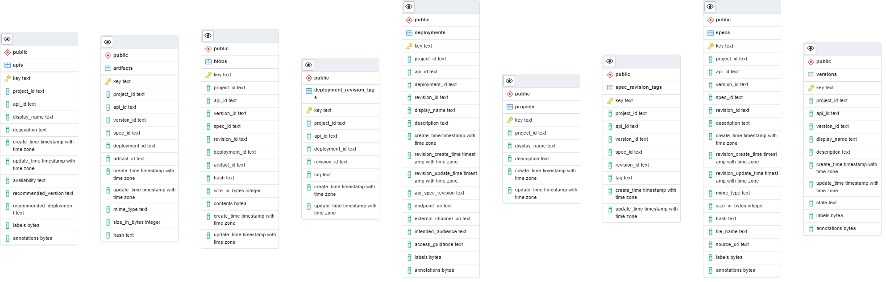

# API Registry

> The Registry API allows teams to track and manage machine-readable descriptions of APIs. 

https://github.com/apigee/registry


## How to run server

```shell
docker-compose up
```

## How to run client

TBD  

## Data model


